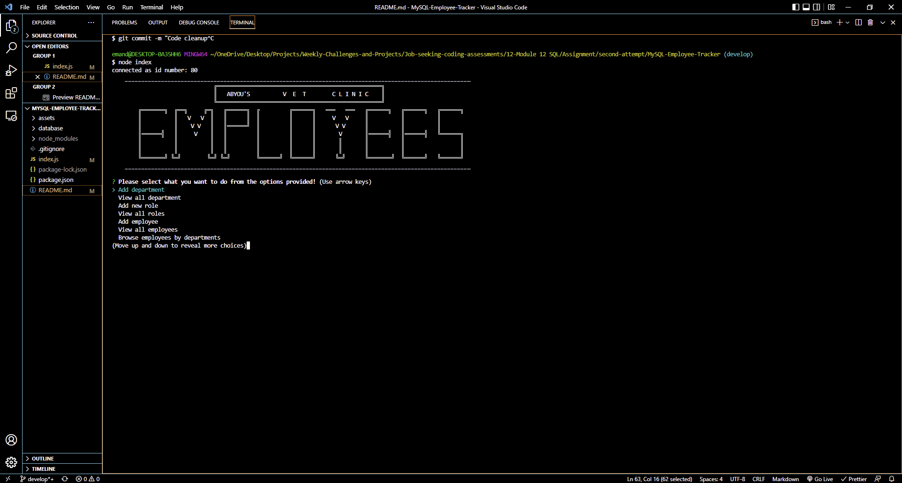

# MySQL Employees Tracker

## Description

    This is a simple, user-friendly, and very powerful Node.js command line application that allows a user to manage employee information for a company. The application connects to a MySQL database that contains three tables containing information about departments, roles, and employees within an organization. This Content Management System allows a user to add, view, and modify information about an organization's employees.

## Table of Content

- [Installation](#installation)
- [Tech and Dependencies](#tech-and-dependencies)
- [Usage](#usage)
- [License](#license)
- [Visual](#visual)
- [Contributing](#contributing)
- [Questions](#questions)

## Installation

    In order to use this application, simply git clone the repo to your local so that you have the Node project there on your local machine, then install the npm package dependencies listed in your package.json file using npm install, and follow clearly written usage guidelines in this file to run the app.

Using the command line, you should run node index.js to start the application.

- You can clone the most recent version of repo into your machine
  https://github.com/ghashe/MySQL-Employee-Tracker

## Tech and Dependencies

- Tech
  - Javascript
  - Node.js
- Dependencies
  - inquirer
  - mySQL2
  - console.table

## Usage

    1. Use npm init -y to create a .json file
    2. Install the npm package dependencies listed in your package.json using npm i
    3. Install inquirer, mysql2, and console.table using the following commands;
        - npm i inquirer
        - npm i mysql2
        - npm i console.table
    As soon as you run the index.js file, the application will launch and you will be able to use it right away

View walk through video here

- [Database setup](https://drive.google.com/file/d/15pQMB-2C2QQconTxnf6h-jXSYMLnfjZP/view) 
- [Features](https://drive.google.com/file/d/1BaQQ57KShJdeKoe14vOncIriw8Z8gFBO/view)
- [Features](https://drive.google.com/file/d/1WlHlltgb03UDGgsAZQq4rr50B6LBibCw/view) 

## License

    MIT license has been applied to this project

## Visual

  
 

## Contributing

    It would be great if you could contribute in any way

## Questions

    I am available at the following email address if you have any questions: emandaabyou@gmail.com

    Here is my GitHub account:  [ghashe](https://github.com/ghashe)

---

_This README has been generated by ❤ [Professional-README-generator](https://github.com/ghashe/professional-README-generator) © 2022_

---
